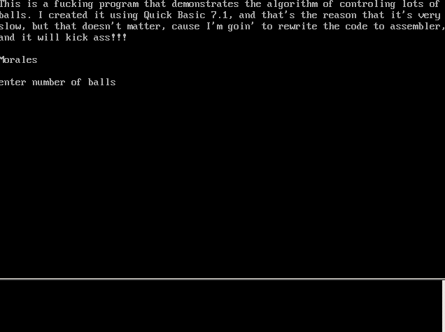

# Code memories
Old programs I wrote during 1990-1996. I recently recovered a good portion of them from an old dusty hard drive. They are mostly written in QBasic 1.1 (or QuickBasic 4.5), Turbo Pascal 6 and 8086 Assembly. Unfortunately I don't have any of the code I wrote in 1989 on an [Amstrad 6128](https://en.wikipedia.org/wiki/Amstrad_CPC#CPC6128).

My favourite resolution was [mode 13h](https://en.wikipedia.org/wiki/Mode_13h) (320x200 with 256 colors). 

I screengrabed them using [ScreenToGif](http://www.screentogif.com/) running on [DOSBox](https://www.dosbox.com/) to present them here.

---
## city
- lang: QBasic
- name: [CITY.BAS](CITY.BAS)
- date: 1992-10-07
- mode: 13h (320x200, 256 colors)
- notes: Layered drawing of a city. Each rendering is different.

---
## balls
- lang: QBasic
- name: [BALLS.BAS](BALLS.BAS)
- date: 1997-03-23
- mode: 12h (640x480, 16 colors)
- notes: Pretty slow programm. Thought that the problem was with the language, lol.

